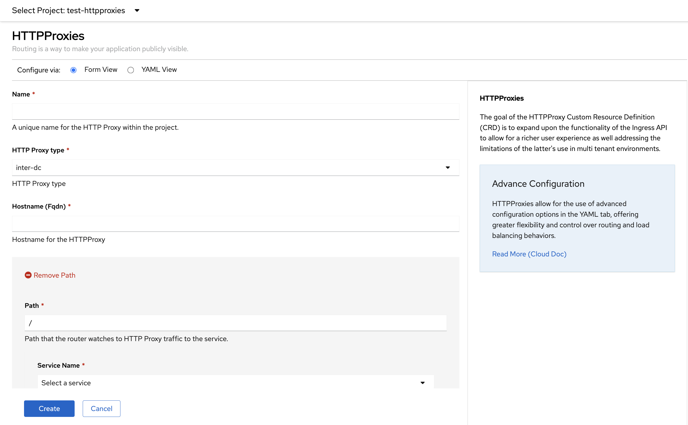

# OpenShift Contour Plugin

Route Generation Form for OpenShift's Contour Plugin
Contour is an ingress controller for Kubernetes that works by deploying the Envoy proxy as a reverse proxy and load balancer. Contour supports dynamic configuration updates out of the box while maintaining a lightweight profile.

## Demo

## Development

In one terminal window, run:

1. `yarn install`
2. `yarn run start`

In another terminal window, run:

1. `oc login` (requires [oc](https://console.redhat.com/openshift/downloads) and an [OpenShift cluster](https://console.redhat.com/openshift/create))
2. `yarn run start-console` (requires [Docker](https://www.docker.com) or [podman 3.2.0+](https://podman.io))
